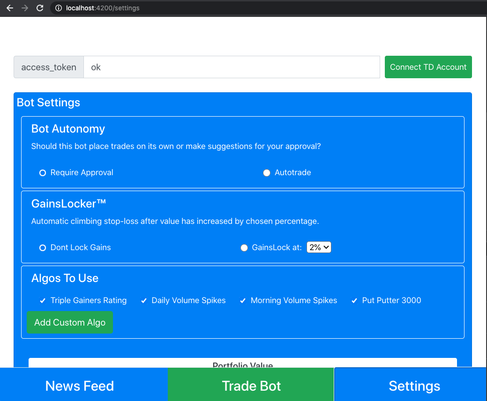
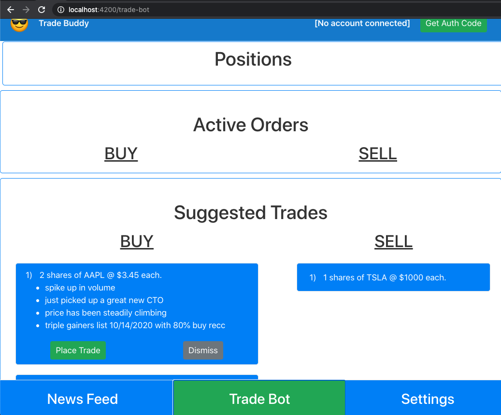
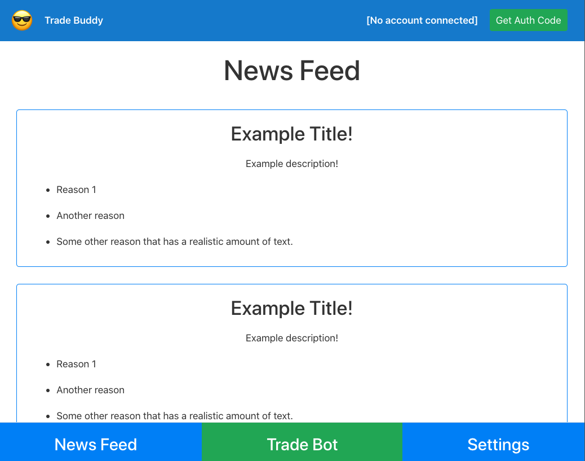

# TradeBuddy
The frontend Angular web-app piece of the overall Trade Buddy platform.

## Dev Setup

### Setup Local HTTPS Cert
In order to run the local server in https mode (necessary for the td-ameritrade api callback), follow [this guide](https://matthewhoelter.com/2019/10/21/how-to-setup-https-on-your-local-development-environment-localhost-in-minutes.html) to create local "cert" and "key" files. 

_Note in package.json how the start script runs the Angular dev server in ssl mode. It looks for the ssl cert in your home directory!_

```
npm start
```

## App Walkthrough
There are 3 core pages of trade buddy: Settings, Trade Bot, and News Feed.

### 1. Settings
This page allows you to connect a TD Ameritrade bot (kind of roundabout process for local dev, but it does work).
This is where the user can eit settings abut how the bot trades.



### 2. Trade Bot
This shows order and positions that the Trade Bot has entered, and suggestiongs (if the suggestion mode setting is enabled).



### 3. News Feed
This page displays interesting information and temporal data that is relevant to the placed trades and watched assets.



## Live Site
(not yet deployed)

## Contributing
Please go through the issues and let [Jim](https://twitter.com/JimLynchCodes) know if you'd like to pick something up!

## Development server

Run `ng serve` for a dev server. Navigate to `http://localhost:4200/`. The app will automatically reload if you change any of the source files.

when running locally, in another shell, also run this:
```
http-server -S -C ~/localhost+3.pem -K localhost+3-key.pem
```
_Note: you can install http-server with `brew install http-server`._


## Code scaffolding

Run `ng generate component component-name` to generate a new component. You can also use `ng generate directive|pipe|service|class|guard|interface|enum|module`.

## Build

Run `ng build` to build the project. The build artifacts will be stored in the `dist/` directory. Use the `--prod` flag for a production build.

## Running unit tests

Run `ng test` to execute the unit tests via [Karma](https://karma-runner.github.io).

## Running end-to-end tests

Run `ng e2e` to execute the end-to-end tests via [Protractor](http://www.protractortest.org/).

## Scaffolding

This project was generated with [Angular CLI](https://github.com/angular/angular-cli) version 10.1.6.

## Further help

To get more help on the Angular CLI use `ng help` or go check out the [Angular CLI README](https://github.com/angular/angular-cli/blob/master/README.md).
